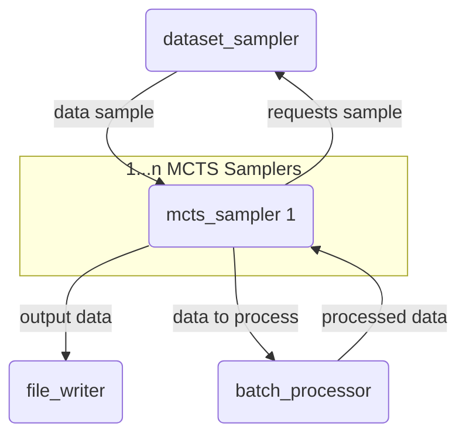

# mcts-llm-sampler

Parallel MCTS Token-level sampling for LLMs.

This repository contains code to generate a dataset using token-level Monte Carlo Tree Search sampling. The dataset can be used to train a value network and to improve the policy (LLM). Currently, the implementation is tailored for the GSM8k dataset, but it should be fairly easy to adapt to other source datasets (as long as they are easily verifiable like math tasks).

Generally the MCTS works like this in my scenario:
- The root node's state are the token ids of the prompt.
- The whole token dictionary serves as the action space.
    - To minimize the large action space, only the top k token ids are used based on the logits from the LLM given the current node's state. For the root node, this is the prompt; for all other nodes, this is the prompt plus all actions which led to this node.
- At each simulation step, an action is chosen according to PUCT starting from the root node.
- Then, a rollout is performed to obtain a solution (sampling greedily or using beam-search until the end is reached).
- The generated solution is then used to determine the Reward (correct/incorrect), which gets backpropagated up to the root node.

A problem with this approach is that it takes a long time to reach deeper states/nodes due to token-level sampling. Using thinking-step/line/sentence-level sampling might make more sense.

MCTS can be parallelized on two axes: we can do multiple searches inside one MCTS tree in parallel by introducing virtual losses, and we can run multiple MCTS instances in parallel. This code does the latter (for now; the former can be added) by using Redis as the message pipeline.

The current implementation is in an early state but works. I've collected traces from 1000 samples from the GSM8k train set to train a validation network using the traces from the resulting MCTS trees. The network currently overfits due to a very limited number of samples, but even so, it improves the performance of the Qwen2.5/0.5B-Instruct Model by about 10% on the first 65 samples of the GSM8k test split. During testing/inference, the MCTS search does not use rollouts and only uses the value network as a feedback signal. After a specified amount of search steps, a final rollout is done.

The current version of the value network can be found here: https://huggingface.co/micaebe/Qwen2.5-0.5B-MCTS-Value-Net. 

## System Architecture

In order to process batch sizes larger than 1, it's necessary to parallelize the MCTS sampling in some way. As stated before, this can be achieved by doing multiple search steps in the same tree in parallel by introducing 'virtual losses' to prevent multiple search steps from going down the same path. This would be necessary to do efficient inference with such a sampling method. However, for collecting data from a large number of examples/tasks, the general throughput is important and not the individual runtime per task. Therefore, this is what is done here: multiple `mcts_samplers` can send a request to the `batch_processor`, which collects the requests and processes them in batches, then sends the results back. After finishing, the `mcts_samplers` send the collected data to the `file_writer`, which stores the data on disk. Then the `mcts_sampler` requests a new task/data sample from the `dataset_sampler`.

The current configuration is for an H200 GPU with 80GB RAM. The current version of the code does not handle crashed services, so in case one service crashes, one needs to manually restart it and eventually some others. In my testing, this did not happen on the described hardware and configurations.